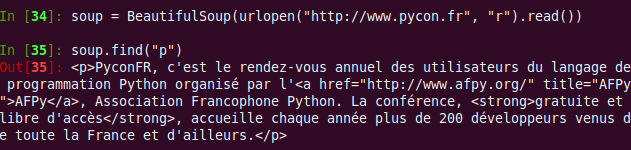
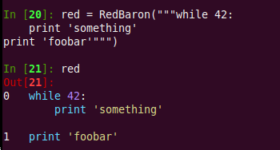
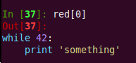
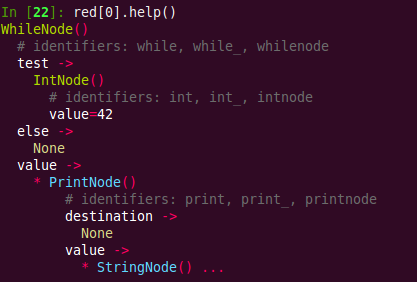
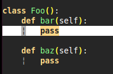
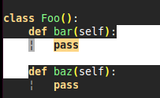
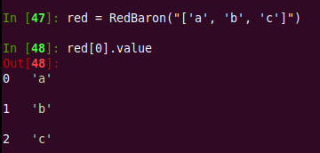
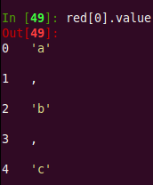
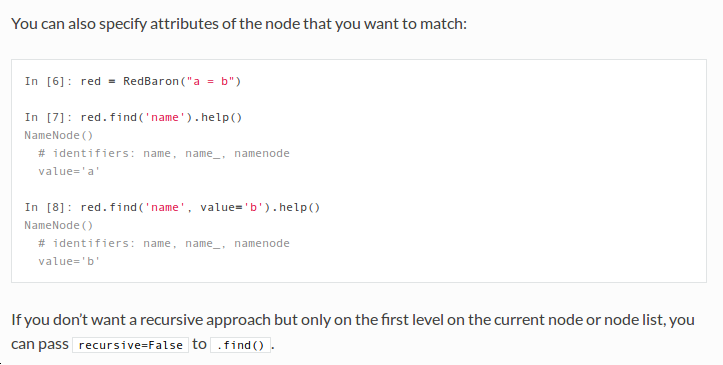

# RedBaron une approche bottom-up au refactoring en Python

---

# Moi

* Laurent Peuch
* Bram

En beaucoup trop détaillé :
[http://worlddomination.be/about/about.html](http://worlddomination.be/about/about.html)

---

# Plan

* Pourquoi ?
* Solution au premier problème (baron)
* Solution au deuxième problème (RedBaron)
* Conclusion

---

# Avant de commencer : revisions

---

# Refactoring (eclipse)

---

# Abstract Syntax Tree (AST)

---

# Pourquoi ?

---

# Refactoring custom

* J'ai toujours voulu écrire du code pour modifier mon code
* Très difficile : string énorme sans sens, analyse, déplacement, trop de possibilités, syntaxe
* Frustrant, plein de cas où "ah, si seulement je pouvais scripter cette modification !"
* Comme une blessure à la lèvre
* Générer du code aussi
* seulement une poignée de gens font ça
* Hyper dur : je suis en (x,y) dans un fichier, y a quoi autour de moi ?

---

# Ast.py

---

# Ast.py

Pas lossless !

    ast_to_code(code_to_ast(code_source)) != source_code

(Commentaires, formatting)

(Et ast\_to\_code n'existe même pas de manière standard).

---

# Ast.py

API Sax like

    !python
    class KeyAttributesFinder(ast.NodeVisitor):
        def visit_Assign(self, assign_node):
            # ...

        def visit_FunctionDef(self, function_node):
            # ...

        # visit_...

Super chiant, impossible à utiliser dans IPython efficacement.

---

# pythonfmt

Auto formater du code python

---

# Génération de code

Django (memopol et co) :

    donnees.json -> models.py + import.py

Autre projet :

    Générer du boiler plate en lisant des models de db

---

# Refactoring : top to bottom

---

# Refactoring en python

* BycleRepairMan
* Rope (ast.py + regexs)
* PyCharm

---

# Conclusion : 2 problèmes

* Il manque la bonne abstraction
* Il manque la bonne interface

---

# Solution 1 : l'abstraction -> Baron

---

# Baron

* ast lossless !
* source == ast\_to\_code(code\_to\_ast(source))
* transforme un problème d'analyse de code en parcours/modification d'un graphe
* output du json pour compatibilité maximum (+ structure de donnée simple)

---

# Exemple

    !python

    from baron.helpers import show

    print show("1 + 2")

    [
        {
            "first_formatting": [
                {
                    "type": "space",
                    "value": " "
                }
            ],
            "value": "+",
            "second_formatting": [
                {
                    "type": "space",
                    "value": " "
                }
            ],
            "second": {
                "section": "number",
                "type": "int",
                "value": "2"
            },
            "type": "binary_operator",
            "first": {
                "section": "number",
                "type": "int",
                "value": "1"
            }
        }
    ]

---

---

# État du projet

*1 an de boulot (j'ai dû apprendre)*

* +1000 tests (TDD)
* marche sur le top 100 de pypi
* utilities : position\_to\_path, position\_to\_node, bounding\_box, walker etc...
* entièrement documenté

---

# Solution 2 : l'interface -> RedBaron

---

# Plan

* principe
* exploration (query)
* modification
* abstraction des listes

---

# RedBaron

* Api au dessus de Baron
* Comme BeautifulSoup/Jquery : mapping structure de donnée -> objects
* Pour l'humain, user friendly autant que possible
* l'interface qui fait tous les trucs chiants pour vous
* Pensé, entre autre, pour être utilisé dans IPython (ou bpython)

---

# RedBaron

API super simple :

    !python
    from redbaron import RedBaron

    red = RedBaron("string représentant du code source")
    # ...
    red.dumps()  # code source

---

# Intuitif (autant que possible)

Surcharge de \_\_repr\_\_ :

BeautifulSoup :

---

# Intuitif (autant que possible)

Surcharge de \_\_repr\_\_ :

BeautifulSoup :

RedBaron :

---

# Auto descriptif

RedBaron :

---

# Auto descriptif

RedBaron :

".help()"

---

# Exploration

Comme BeautifulSoup :

    !python
    red = RedBaron("a = 42\ndef test_chocolat(): pass")
    red.find("name")
    red.find("int", value=42)
    red.find("def", name="g:test_*")
    red.find("def", name="re:test_*")
    red.find("assignment", lambda x: x.target.dumps() == "INSTALLED_APPS")

    red.find_all("name")
    red.find_all(("name", "int"))
    red.find_all("def", arguments=lambda x: len(x) == 3)
    red.find_all("def", recursive=False)

---

# Exploration

Comme BeautifulSoup :

    !python
    red = RedBaron("a = 42\ndef test_chocolat(): pass")
    red.find("name")
    red.find("int", value=42)
    red.find("def", name="g:test_*")
    red.find("def", name="re:test_*")
    red.find("assignment", lambda x: x.target.dumps() == "INSTALLED_APPS")

    red.find_all("name")
    red.find_all(("name", "int"))
    red.find_all("def", arguments=lambda x: len(x) == 3)
    red.find_all("def", recursive=False)

Raccourcis (comme BeautifulSoup) :

    !python
    red = RedBaron("a = 42\ndef test_chocolat(): pass")
    red.name
    red.int
    red.else_

    red("name")
    red(("name", "int"))
    red("def", arguments=lambda x: len(x) == 3)

---

# Modification

Comment modifier une node ?

    !python
    from redbaron import RedBaron, BinaryOperatorNode

    red = RedBaron("a = 'plop'")
    red[O].value  # 'plop'
    red[0].value = BinaryOperatorNode({'first_formatting':[{'type': 'space',
    'value': ' '}], 'value': '+', 'second_formatting': [{'type': 'space',
    'value': ' '}], 'second': {'section': 'number', 'type': 'int', 'value':
    '1'}, 'type': 'binary_operator', 'first': {'section': 'number', 'type':
    'int', 'value': '1'}})

Pas hyper pratique ...

---

# Magie de \_\_setattr\_\_

    !python
    from redbaron import RedBaron, BinaryOperatorNode

    red = RedBaron("a = 'plop'")
    red[0].value = "1 + 1"

    # marche aussi avec : nodes redbaron et ast

Marche pour __toutes__ les nodes.

---

# Modifications avancées :

Autre problème : quel est le corps/body de la fonction "bar" ?

    !python
    class Foo():
        def bar(self):
            pass

        def baz(self):
            pass

---

# Modifications avancées :

Autre problème : quel est le corps/body de la fonction "bar" ?

    !python
    class Foo():
        def bar(self):
            pass

        def baz(self):
            pass

Expected :

---

# Modifications avancés :

Autre problème : quel est le corps/body de la fonction "bar" ?

    !python
    class Foo():
        def bar(self):
            pass

        def baz(self):
            pass

Expected :

Reality :

---

# Solution : magie !

    !python

    red.find("def", name="bar").value = "pass"
    red.find("def", name="bar").value = "pass\n"
    red.find("def", name="bar").value = "    pass\n"
    red.find("def", name="bar").value = "    pass\n    "
    red.find("def", name="bar").value = "        pass\n        "
    red.find("def", name="bar").value = "\n    pass\n    "
    # etc ..

Pareil pour les : *else*, *exceptions*, *finally*, *elif* etc ...

---

# Listes

Problème : combien d'éléments dans le corps de cette liste ? <code>['a', 'b', 'c']</code>

---

# Listes

Problème : combien d'éléments dans le corps de cette liste ?

**Expected** :

---

# Listes

Problème : combien d'éléments dans le corps de cette liste ?

**Expected** :

**Reality** :

---

# Listes : solutions

Solution : des "proxy" de listes qui donnent la même API que les listes python et gèrent le formatting pour vous.

**Reality again** :

Marche pour les :

* "," (avec et sans indentation)
* les ".", par exemple : <code>a.b.c().pouet[stuff]</code>
* les lignes séparées par des retours à la ligne (corps des fonctions, "bloc python")

---

# Helpers

* <code>.map</code>
* <code>.apply</code>
* <code>.filter</code>
* <code>.next</code>, <code>.previous</code>, <code>.parent</code>
* <code>.replace</code>

---

# Quelques exemples

    !python

    # renommer un 'name' (attention : renommera pas tout)
    for i in red('name', value='pouet'): i.value = 'plop'

---

# Quelques exemples

    !python

    # installer une django app
    red.find("assign", target=lambda x: x.dumps() == 'INSTALLED_APPS').\
        value.append("'debug_toolbar.apps.DebugToolbarConfig'")

---

# Quelques exemples

    !python

    # lines_profiler
    red('def', recursive=False).\
        map(lambda x: x.decorators.insert(0, '@profile'))

---

# Quelques exemples

    !python

    # lines_profiler
    red('def', recursive=False).\
        map(lambda x: x.decorators.insert(0, '@profile'))

    # les retirer
    red("decorator", lambda x: x.dumps() == "@decorator").\
        map(lambda x: x.parent.parent.decorators.remove(x))

---

# Quelques exemples

    !python

    # print a -> logger.debug(a)
    red('print', value=lambda x: len(x) == 1).\
        map(lambda x: x.replace('logger.debug(%s)' % x.value.dumps())

    # print a, b, c -> logger.debug("%s %s %s" % (a, b, c))
    red('print', value=lambda x: len(x) == 1).\
        map(lambda x: x.replace('logger.debug("%s" % (%s))' %
                                    (" ".join('%s' * len(x.value)))

---

---

# État

* +1200 tests
* entièrement documenté (plein d'exemples)
* tutoriel
* librairie de référence pour écrire du code qui modifie du code
* encore un peu rugueux (alpha ?)
* devrait remplir 80% des cas
* **pas** d'analyse statique (plus tard avec rope/astroid ?)

---

# Documentation

Exemples executés à la compilation :

---

# Projets voisins: PyFmt

Usage:

    pyfmt file.py  # output to standard output
    pyfmt -i file.py  # replace the content of the file, like -i of sed

Depuis python:

    !python
    from pyfmt import format_code

    format_code(source_code)

---

# Projets voisins: RedFlyingBaron

    !bash
    red *.py  # dans un shell bash/zsh/autre

Qui lance un shell:

    !python
    red
    red[0]
    red["./test_redflyingbaron.py"]
    red["test_redflyingbaron.py"]
    red["test_redflyingbaron"]
    red[1:]

    red.display()

    red[0].save()
    red.save()
    red[0].reload()
    red.reload()

    red["f:redflyingbaron"]
    red[re.compile(r'[^_]+')]
    red["re:[^_]+"]
    red[lambda key, value: "red" in key]

    red.find("stuff")
    red.find_all("stuff")

    red.add("/path/to/file", "/path/to/another/file", "again.py")

---

# Conclusion

---

---

# « Mec, t'es en train de coder le nouvel 'ed' du 21 ème siècle avec 4 niveaux d'abstractions en plus » un pote, fin bourré

---

# Infos

RedBaron :

* [https://github.com/psycojoker/redbaron](https://github.com/psycojoker/redbaron)
* [https://baron.readthedocs.org](https://baron.readthedocs.org)
* <code>pip install redbaron</code>

Baron :

* [https://github.com/psycojoker/baron](https://github.com/psycojoker/baron)
* [https://redbaron.readthedocs.org](https://redbaron.readthedocs.org)
* <code>pip install baron</code>

Contacts :

* Moi : cortex@worlddomination.be
* Irc : irc.freenode.net#baron
